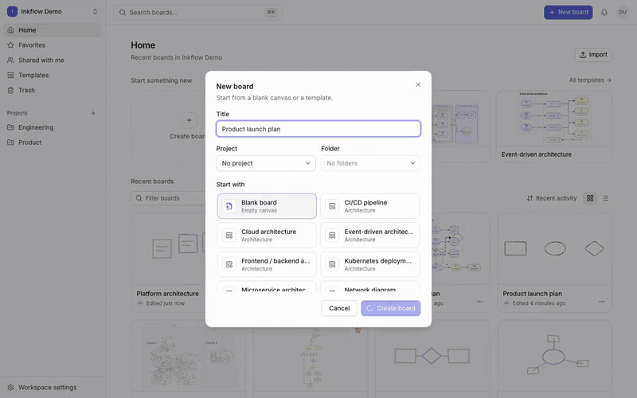
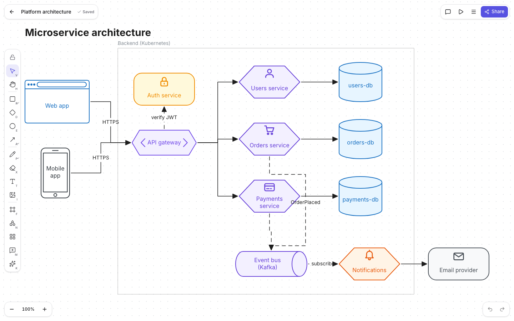
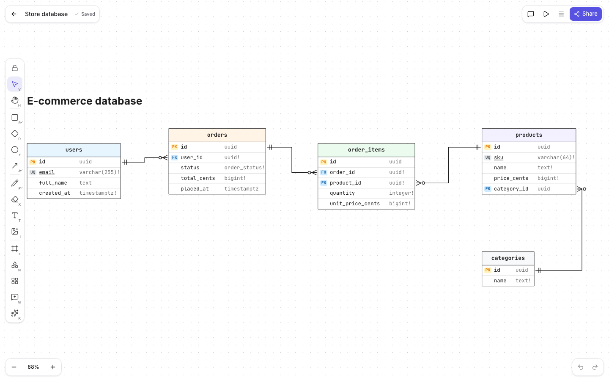
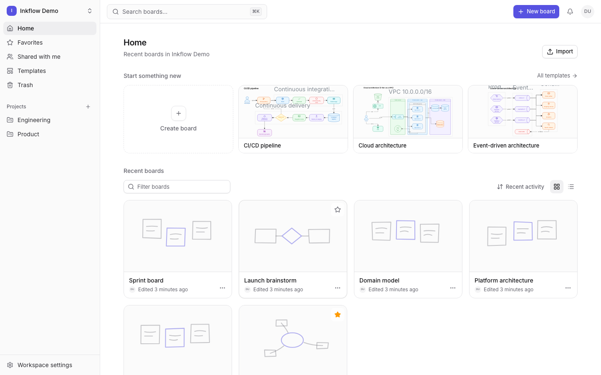

# Inkflow

**An infinite-canvas whiteboard and diagramming platform with a hand-drawn look, real-time
collaboration and offline editing.**

Inkflow is an Excalidraw-class editor built from scratch: a custom canvas engine and renderer, a
semantic diagram engine (smart connectors, obstacle-avoiding routing, automatic layout, ER, UML
and sequence diagrams), multiplayer editing over WebSockets, and a NestJS + PostgreSQL backend
that stores every board, version and comment.


## Demo

[](docs/demo/inkflow-demo.mp4)

**[▶ Watch the full narrated demo (1:49, MP4)](docs/demo/inkflow-demo.mp4)**. It covers the dashboard, drawing and
styling, text and freehand, smart connectors, undo/redo, templates and the shape library, Mermaid
import with auto layout, real-time collaboration with a second user, comments, version history,
export, architecture and ER diagrams, presentation mode and dark mode.



<table>
  <tr>
    <td></td>
    <td></td>
  </tr>
</table>

---

## Contents

- [Demo](#demo)
- [Features](#features)
- [Tech stack](#tech-stack)
- [Quick start](#quick-start)
- [Running everything in containers](#running-everything-in-containers)
- [Deployment](#deployment)
- [Testing](#testing)
- [Commands](#commands)
- [Configuration](#configuration)
- [Project structure](#project-structure)
- [How it works](#how-it-works)
- [Documentation](#documentation)
- [Troubleshooting](#troubleshooting)

## Features

### Canvas and drawing

- Infinite canvas with pan and zoom: mouse wheel, trackpad pinch, touch pinch, space-drag,
  middle-mouse drag, fit to content, selection or frame.
- 22 tools: selection, hand, rectangle, rounded rectangle, ellipse, diamond, triangle, polygon,
  star, line, arrow, connector, pencil, brush, highlighter, eraser, text, image, frame, diagram
  node, comment and laser pointer.
- Hand-drawn rendering with hachure, cross-hatch, zigzag and solid fills and three sloppiness
  levels. Every shape is seeded, so it looks identical after a reload, on another device, in an
  export or on a collaborator's screen.
- Pressure-sensitive vector freehand drawing with smoothing and simplification.
- HiDPI rendering, viewport culling and drawable caches keep boards with 10,000+ elements smooth.

### Editing

- Single, multi, marquee, Shift and Ctrl/Cmd selection; Alt-click to select underneath.
- Rotation-aware resize with aspect lock and center scaling, rotation snapping, flips.
- Nested groups, frames, alignment and distribution, z-order, lock and hide.
- Snapping to grid (dot, square or isometric), object edges and centers, connection points and angles, with guides.
- Copy, cut, paste (including from other apps), paste in place and duplicate, preserving groups,
  connections and images.
- Transaction-based undo/redo: a whole drag is one undo step.
- Inline text editing: multiline, wrapping, auto or fixed width, fonts, bold, italic, underline,
  alignment, line height and letter spacing.
- Images: upload, drag and drop, paste, crop, replace, opacity and aspect lock (PNG, JPEG, WebP, GIF, SVG).
- More than 90 keyboard shortcuts (all customizable), a command palette and a context menu.
- A color picker with presets, HEX/RGB/HSL input, alpha, an eyedropper, recent colors and favorites.

### Diagrams

- 61 node shapes and 77 icons, all extensible through a shape registry.
- Smart connectors bound to nodes and ports, with straight, curved, bézier, elbow and
  obstacle-avoiding orthogonal routing. Connectors follow their nodes when those move.
- Automatic layout: hierarchical (Sugiyama), tree, grid, horizontal, vertical and force-directed.
- ER tables with primary/foreign keys and crow's-foot cardinalities, UML classes and relations, and
  sequence diagrams with lifelines, activations and notes.
- A library of 101 technical symbols (servers, databases, queues, load balancers, cloud services…)
  and 25 editable templates (microservices, OAuth, CI/CD, Kubernetes, ERD, payments…).
- Import from Mermaid (flowchart, sequence, ER and class diagrams).

### Collaboration and persistence

- Real-time multiplayer: live cursors, selections, presence, follow mode and live previews while
  others drag.
- An operation-based sync protocol with per-property conflict resolution. Changes made offline are
  queued in IndexedDB and synced when the connection returns.
- Autosave to PostgreSQL with a "Saving… / Saved / Offline / Syncing…" indicator.
- Automatic and manual version history, with comparison and restore.
- Comments pinned to points, elements or frames, with replies, @mentions, resolve and reopen.
- Sharing as owner, editor or viewer, plus public links that can expire. Permissions are enforced
  by the server.

### Workspace and product

- Workspaces with members and roles, projects, folders, favorites, recent boards, shared with me,
  trash and restore, and search across boards.
- Export to PNG (transparent, scaled, re-importable), vector SVG, PDF (one page per frame) and JSON.
- Import native JSON, Excalidraw files, SVG, images and Mermaid.
- Presentation mode: frames become fullscreen slides with keyboard navigation and a laser pointer.
- Accounts with email verification, password reset, session management, and optional Google and
  GitHub login.
- Light, dark and high-contrast themes, keyboard and screen-reader accessibility, and responsive
  mobile layouts with touch drawing.

## Tech stack

| Layer   | Technology                                                                                                    |
| ------- | ------------------------------------------------------------------------------------------------------------- |
| Web app | React 19, TypeScript, Vite 7, Tailwind CSS 4, shadcn/ui (Radix), Zustand, React Router 7, TanStack Query, Zod |
| Editor  | Custom canvas engine and renderer (HTML Canvas + SVG, Pointer Events), no third-party whiteboard library      |
| API     | Node.js 24, NestJS 11, WebSockets (`ws`), OpenAPI                                                             |
| Data    | PostgreSQL 17 (Prisma 6), Redis 7 (pub/sub, presence, rate limits), S3-compatible storage (MinIO locally)     |
| Email   | SMTP (Mailpit locally)                                                                                        |
| Tooling | pnpm workspaces, tsup, Vitest, Playwright, ESLint, Prettier, Podman                                           |

## Quick start

### Prerequisites

- **Node.js** 22.12 or newer (24 recommended)
- **pnpm** 10 (`corepack enable`)
- **Podman** with `podman compose`

  On macOS:

  ```bash
  brew install podman podman-compose
  ```

  ```bash
  podman machine init && podman machine start
  ```

### 1. Install dependencies

```bash
pnpm install
```

### 2. Create your environment file

```bash
cp .env.example .env
```

The defaults work out of the box for local development.

### 3. Start PostgreSQL, Redis, MinIO and Mailpit

```bash
podman compose up -d postgres redis minio minio-init mailpit
```

### 4. Apply database migrations

```bash
pnpm db:migrate
```

### 5. Load demo data (optional)

```bash
pnpm db:seed
```

### 6. Run the app

```bash
pnpm dev
```

Open **http://localhost:5173** and sign in with the demo account:

| Email              | Password            |
| ------------------ | ------------------- |
| `demo@inkflow.dev` | `inkflow-demo-2024` |

The demo workspace contains a flowchart, an ER diagram, an architecture diagram, a UML class
diagram, a mind map and a kanban board. New accounts are verified through the email you'll find in
Mailpit.

### Local services

| Service                   | URL / port                                               |
| ------------------------- | -------------------------------------------------------- |
| Web app                   | http://localhost:5173                                    |
| API (proxied at `/api`)   | http://localhost:4310/api                                |
| OpenAPI docs              | http://localhost:5173/api/docs                           |
| Mailpit (captured emails) | http://localhost:8026                                    |
| MinIO console             | http://localhost:9001 (`inkflow` / `inkflow-dev-secret`) |
| PostgreSQL                | `localhost:5433` (`inkflow` / `inkflow`)                 |
| Redis                     | `localhost:6379`                                         |

Host ports can be changed with `INKFLOW_POSTGRES_PORT`, `INKFLOW_REDIS_PORT`, `INKFLOW_MINIO_PORT`,
`INKFLOW_SMTP_PORT`, `INKFLOW_MAILPIT_UI_PORT` and `INKFLOW_WEB_PORT`.

## Running everything in containers

Build and start the API and web images alongside the infrastructure:

```bash
podman compose --profile app up -d --build
```

Open **http://localhost:8190**. The API runs in production mode and applies migrations on start.
nginx serves the web app and proxies `/api` and the WebSocket.

- The container stack does not read your `.env`. Set `INKFLOW_JWT_SECRET` and
  `INKFLOW_SESSION_SECRET` for anything beyond local testing.
- The web image build fits the default 2 GB Podman machine. If a build is killed for memory, build
  the images one at a time:

  ```bash
  podman compose --profile app build api && podman compose --profile app build web
  ```

Stop the stack:

```bash
podman compose --profile app down
```

`docker compose` works with the same file.

## Deployment

Inkflow runs anywhere that offers containers, managed PostgreSQL and Redis, S3-compatible storage
and a TLS load balancer with WebSocket support. [DEPLOYMENT.md](DEPLOYMENT.md) has the full guide:
requirements, a best-practices checklist (security, reliability, backups, observability), and
step-by-step recipes.

| Target          | How                                                                                         | Assets in this repo                                                   |
| --------------- | ------------------------------------------------------------------------------------------- | --------------------------------------------------------------------- |
| Single VM       | Podman/Docker Compose behind Caddy for TLS                                                  | `docker-compose.yml`                                                  |
| Any Kubernetes  | Kustomize base with ingress-nginx and cert-manager, migration Job, HPA, PDBs                | [`deploy/kubernetes/base`](deploy/kubernetes/base)                    |
| AWS EKS         | ALB ingress + ACM, RDS, ElastiCache, S3 through IRSA, ECR                                   | [`deploy/kubernetes/overlays/eks`](deploy/kubernetes/overlays/eks)    |
| AWS ECS Fargate | Two services behind one ALB, Secrets Manager, task role for S3, one-off migration task      | [DEPLOYMENT.md](DEPLOYMENT.md#c2-amazon-ecs-on-fargate-no-kubernetes) |
| GCP GKE         | GCE ingress + managed certificate, Cloud SQL, Memorystore, Cloud Storage, Workload Identity | [`deploy/kubernetes/overlays/gke`](deploy/kubernetes/overlays/gke)    |
| GCP Cloud Run   | API and web services behind one HTTPS load balancer, Cloud Run migration job                | [DEPLOYMENT.md](DEPLOYMENT.md#d2-cloud-run-serverless)                |

Essentials in every environment:

- Build immutable images in CI (`.github/workflows/ci.yml` tests, then pushes both images to GHCR
  tagged by commit).
- Run migrations once per release (`docker run IMAGE migrate`, the Kubernetes Job, an ECS task or
  a Cloud Run job) and set `SKIP_MIGRATIONS=true` on the API.
- Keep secrets in a secrets manager; use workload identity for storage where possible.
- Route `/api` (including the `/api/ws` WebSocket) to the API with a long idle timeout, and
  everything else to the web service.
- Run at least two replicas of each service with health checks (`/api/health/ready`) and
  database backups with point-in-time recovery.

## Testing

| Suite       | Command                 | What it covers                                                                                                                                                                                                |
| ----------- | ----------------------- | ------------------------------------------------------------------------------------------------------------------------------------------------------------------------------------------------------------- |
| Unit        | `pnpm test`             | Geometry, transforms, selection, rendering, serialization, history, routing, layout, sync client, importers, UI components and the API's services (~730 tests)                                                |
| Integration | `pnpm test:integration` | API against real PostgreSQL, Redis, MinIO and Mailpit: auth, permissions, boards, sharing, comments, files, versions, WebSocket collaboration                                                                 |
| End-to-end  | `pnpm test:e2e`         | Playwright in real browsers: register and verify, draw, connect, undo/redo, persistence checked in PostgreSQL, sharing, two-browser collaboration, offline sync, exports, versions, permissions, mobile touch |

Integration and E2E tests use a separate `inkflow_test` database and their own ports, so they
don't touch your development data. Install the Playwright browser once:

```bash
pnpm exec playwright install chromium
```

## Commands

| Command                             | Description                                                                         |
| ----------------------------------- | ----------------------------------------------------------------------------------- |
| `pnpm dev`                          | Build the packages, then run them in watch mode with the API and the web dev server |
| `pnpm build`                        | Production build of every package, the API and the web app                          |
| `pnpm test`                         | Unit tests                                                                          |
| `pnpm test:integration`             | API integration tests                                                               |
| `pnpm test:e2e`                     | Playwright end-to-end tests                                                         |
| `pnpm lint` / `pnpm lint:fix`       | ESLint (zero warnings allowed)                                                      |
| `pnpm format` / `pnpm format:check` | Prettier                                                                            |
| `pnpm typecheck`                    | TypeScript for every workspace                                                      |
| `pnpm db:migrate`                   | Create and apply migrations in development                                          |
| `pnpm db:migrate:deploy`            | Apply committed migrations (production)                                             |
| `pnpm db:seed`                      | Seed the demo workspace and boards                                                  |
| `pnpm db:reset`                     | Drop and recreate the development database                                          |
| `pnpm infra:up` / `pnpm infra:down` | Start or stop the infrastructure containers                                         |
| `pnpm stack:up` / `pnpm stack:down` | Start or stop the full containerized stack                                          |

## Configuration

All settings come from environment variables. They are documented in
[`.env.example`](.env.example) and validated when the API starts. In production the API refuses
placeholder secrets.

| Variable                                                     | Purpose                                                         |
| ------------------------------------------------------------ | --------------------------------------------------------------- |
| `DATABASE_URL`                                               | PostgreSQL connection string                                    |
| `REDIS_URL`                                                  | Redis connection string                                         |
| `JWT_SECRET`, `SESSION_SECRET`                               | Signing and encryption secrets (32+ characters)                 |
| `WEB_ORIGIN`, `PUBLIC_API_URL`                               | Public URLs used for CORS, email links and OAuth callbacks      |
| `S3_ENDPOINT`, `S3_BUCKET`, `S3_ACCESS_KEY`, `S3_SECRET_KEY` | Object storage for images and thumbnails                        |
| `SMTP_HOST`, `SMTP_PORT`, `MAIL_FROM`                        | Outgoing email; without SMTP, emails are written to the API log |
| `GOOGLE_CLIENT_ID/SECRET`, `GITHUB_CLIENT_ID/SECRET`         | Optional OAuth; the login buttons appear only when configured   |
| `REQUIRE_EMAIL_VERIFICATION`                                 | Require a verified email before signing in (default `true`)     |

## Project structure

```text
apps/
  api/             NestJS API: REST, WebSocket gateway, background jobs, seed
  web/             React app: dashboard, auth, settings and the board editor
packages/
  shared/          API contracts (Zod schemas and DTOs), roles, errors, utilities
  config/          Environment schema
  geometry/        Vectors, bounds, intersections, SVG paths, spatial index, seeded random
  elements/        Element model, schema, text layout, hit testing
  scene/           Scene store, history, operations, document format and migrations
  diagram-engine/  Shapes, icons, ports, routing, layout, ER/UML/sequence, library, templates
  renderer/        Hand-drawn canvas and SVG renderer
  canvas-engine/   Editor core: tools, input, selection, transforms, snapping, shortcuts
  collaboration/   Sync protocol and client
  exporters/       PNG, SVG, PDF and JSON export
  importers/       JSON, Excalidraw, SVG, Mermaid and image import
  database/        Prisma schema, migrations and client
  ui/              Accessible UI components
e2e/               Playwright tests
infra/             Container init scripts
```

## How it works

```text
React UI ──▶ Editor state ──▶ Canvas engine (tools, input) ──▶ Scene model (transactions, history)
                                                                   │
                        Renderer (canvas + SVG) ◀──────────────────┤
                                                                   ▼
             IndexedDB (cache, offline queue) ◀── Sync client ──▶ WebSocket / HTTP
                                                                   │
                                   NestJS API ──▶ PostgreSQL (source of truth)
                                        │    └──▶ Redis (fan-out, presence)
                                        └───────▶ S3 (images)
```

- **Edits are transactions.** A gesture updates the scene live and commits as one undo step and
  one batch of operations.
- **Operations, not documents, travel over the wire.** Only changed properties are sent. The
  server applies them in a PostgreSQL transaction and broadcasts the results to every instance
  through Redis.
- **Conflicts merge per property.** Two people moving and recoloring the same shape both keep their
  change; deletions win unless explicitly undone.
- **Diagrams are semantic.** Connectors reference their nodes and ports, and their routes are
  recomputed whenever a node moves.

## Documentation

| Document                                     | Contents                                                      |
| -------------------------------------------- | ------------------------------------------------------------- |
| [ARCHITECTURE.md](ARCHITECTURE.md)           | System design, layers, data flow, security model              |
| [CANVAS_ENGINE.md](CANVAS_ENGINE.md)         | Editor core, input handling, rendering pipeline, performance  |
| [DIAGRAM_ENGINE.md](DIAGRAM_ENGINE.md)       | Shapes, ports, routing, layout, templates, importers          |
| [COLLABORATION.md](COLLABORATION.md)         | Operations, conflict resolution, protocol, offline sync       |
| [DATABASE.md](DATABASE.md)                   | PostgreSQL schema, constraints, indexes, migrations           |
| [DEPLOYMENT.md](DEPLOYMENT.md)               | Production configuration, images, scaling, security checklist |
| [docs/API_CONTRACT.md](docs/API_CONTRACT.md) | REST and WebSocket API reference                              |

## Troubleshooting

**A port is already in use.** Another project may be using 5433, 6379, 9000 or 8026. Change the
port with the matching `INKFLOW_*_PORT` variable and update `.env` to match.

**`podman compose` says no compose provider was found.** Install `podman-compose`
(`brew install podman-compose` on macOS).

**Nobody receives verification emails.** In development they are captured by Mailpit at
http://localhost:8026. Without SMTP configured, the API prints the verification link in its log.

**The container API exits right after starting.** It refuses the development placeholder secrets
in production mode. Set `INKFLOW_JWT_SECRET` and `INKFLOW_SESSION_SECRET`, or keep the compose
defaults for local testing.

**The web image build is killed.** The Podman machine is out of memory. Build the images one at a
time (see [Running everything in containers](#running-everything-in-containers)), or give the
machine more memory with `podman machine set --memory 4096`.
